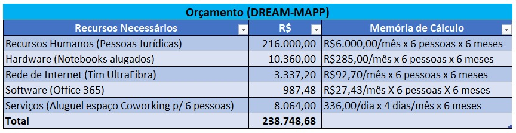

# Especificações do Projeto

A definição exata do problema e os pontos mais relevantes a serem tratados neste projeto foram consolidados com a participação dos usuários em um trabalho de imersão feita pelos membros da equipe a partir da observação dos usuários em seu local natural e por meio de entrevistas. Os detalhes levantados nesse processo foram afirmados na forma de personas e histórias de usuários

## Personas

Seguem demonstradas por meio dos quadros apresentados o levantamento feito das personas e suas características durante o processo de entendimento do problema:

<table>
  <tr>
   <td width="1000" colspan="5" align="center">Carlos Augusto Santos, 26 anos.</td>
  </tr>
  <tr>
   <td width="200" align="center" height="200" rowspan="3"></td>
   <td width="150" align="center">Ocupação</td>
   <td colspan="3">Analista de Sistemas.</td>
   <tr>
    <td width="150" align="center">Aplicativos</td>
    <td width="210" align="center">Motivações</td>
    <td width="210" align="center">Frustrações</td>
    <td width="240" align="center">Hobbies, História</td>
   </tr>
  </tr>
  <tr>
   <td>
    ●	Linkedin 
    ●	Instagram 
    ●	Stack Overflow 
    ●	WhatsApp 
    ●	Telegram 
    ●	Discord 
    ●	Youtube 
    ●	Udemy 
   </td>
   <td>
    ●	Ter maior controle sobre suas metas, prazos e objetivos para melhora na carreira.
   </td>
   <td>
    ●	Não conseguir entregar seus projetos dentro do prazo. 
    ●	Não ter boa organização de seus estudos. 
   </td>
   <td>
    ●	Estudar Programação. 
    ●	Ler. 
    ●	Estudar outras línguas. 
    ●	Adquirir Soft Skills. 
   </td>
  </tr>
 </table>
 
 <table>
  <tr>
   <td width="1000" colspan="5" align="center">Sandro Motta, 39 anos.</td>
  </tr>
  <tr>
   <td width="200" align="center" height="200" rowspan="3"></td>
   <td width="150" align="center">Ocupação</td>
   <td colspan="3">Oficial de Justiça.</td>
   <tr>
    <td width="150" align="center">Aplicativos</td>
    <td width="210" align="center">Motivações</td>
    <td width="210" align="center">Frustrações</td>
    <td width="240" align="center">Hobbies, História</td>
   </tr>
  </tr>
  <tr>
   <td>
    ●	Facebook 
    ●	Instagram 
    ●	WhatsApp 
    ●	Tse 
    ●	Portal Fazenda.gov 
    ●	Apple Books 
   </td>
   <td>
    ●	Tornar-se excelência na prestação de seus serviços à comunidade. 
    ●	Passar mais tempo com a família.
   </td>
   <td>
    ●	Dificuldade em ter momentos familiares. 
    ●	Falta de gestão eficiente de tempo útil.
   </td>
   <td>
    ●	Resolver todos os casos que chegam em suas mãos com excelência. 
    ●	Profissional dedicado e obcecado por resultados.
   </td>
  </tr>
 </table>
 
  <table>
  <tr>
   <td width="1000" colspan="5" align="center">Dominique de Cuoco, 28 anos.</td>
  </tr>
  <tr>
   <td width="200" align="center" height="200" rowspan="3"></td>
   <td width="150" align="center">Ocupação</td>
   <td colspan="3">Fisioterapeuta.</td>
   <tr>
    <td width="150" align="center">Aplicativos</td>
    <td width="210" align="center">Motivações</td>
    <td width="210" align="center">Frustrações</td>
    <td width="240" align="center">Hobbies, História</td>
   </tr>
  </tr>
  <tr>
   <td>
    ●	Facebook 
    ●	Instagram 
    ●	WhatsApp 
    ●	Bancos Digitais 
    ●	Kavak 
    ●	Web Motors 
    ●	Uber
   </td>
   <td>
    ●	Comprar um carro. 
    ●	Otimizar seu tempo e aumentar seu conforto por meio do veículo a ser adquirido. 
   </td>
   <td>
    ●	Não conseguir organizar suas finanças. 
    ●	Não conseguir estipular um plano efetivo para compra do carro sem se endividar. 
    ●	Ter que depender de aplicativos de deslocamento.
   </td>
   <td>
    ●	Viajar com a família. 
    ●	Atender pacientes em domicilio. 
    ●	Se especializar em técnicas de terapias alternativas do trabalho.
   </td>
  </tr>
 </table>

   <table>
  <tr>
   <td width="1000" colspan="5" align="center">Elizabete Kim, 22 anos.</td>
  </tr>
  <tr>
   <td width="200" align="center" height="200" rowspan="3"></td>
   <td width="150" align="center">Ocupação</td>
   <td colspan="3">Blogueira/Influenciadora Digital.</td>
   <tr>
    <td width="150" align="center">Aplicativos</td>
    <td width="210" align="center">Motivações</td>
    <td width="210" align="center">Frustrações</td>
    <td width="240" align="center">Hobbies, História</td>
   </tr>
  </tr>
  <tr>
   <td>
    ●	Facebook 
    ●	Instagram 
    ●	Twitter 
    ●	TikTok 
    ●	Youtube 
    ●	Photoshop 
    ●	DaVinci Resolve
   </td>
   <td>
    ●	Ter mais constância em suas postagens. 
    ●	Crescer como profissional digital. 
    ●	Bater metas estipuladas por patrocinadores.
   </td>
   <td>
    ●	Dificuldade em organização pessoal e profissional. 
    ●	Oportunidades perdidas de patrocinadores por dificuldade de agenda.
   </td>
   <td>
    ●	Gerenciar suas mídias Sociais. 
    ●	Praticar exercícios físicos. 
    ●	Aprofundar-se nos estudos de sua área de atuação.
   </td>
  </tr>
 </table>
 
<table>
  <tr>
   <td width="1000" colspan="5" align="center">Katarina Sanches, 46 anos.</td>
  </tr>
  <tr>
   <td width="200" align="center" height="200" rowspan="3"></td>
   <td width="150" align="center">Ocupação</td>
   <td colspan="3">Empresária do ramo de cosméticos.</td>
   <tr>
    <td width="150" align="center">Aplicativos</td>
    <td width="210" align="center">Motivações</td>
    <td width="210" align="center">Frustrações</td>
    <td width="240" align="center">Hobbies, História</td>
   </tr>
  </tr>
  <tr>
   <td>
    ●	Linkedin 
    ●	Instagram 
    ●	TikTok 
    ●	Youtube 
    ●	Shopee
   </td>
   <td>
    ●	Crescer sua empresa e maximizar seus lucros. 
    ●	Terceirizar serviços. 
    ●	Organizar seu tempo e sua agenda entre vida pessoal e empresarial.  
   </td>
   <td>
    ●	Falta de resultados expressivos na busca de mão de obra qualificada. 
    ●	Perda de tempo e de dinheiro ao não conseguir uma equipe qualificada para construir seus projetos.
   </td>
   <td>
    ●	Criar artes gráficas. 
    ●	Maquiagem. 
    ●	Redes sociais
   </td>
  </tr>
 </table>
 
 <table>
  <tr>
   <td width="1000" colspan="5" align="center">Raimundo Ronaldo, 30 anos.</td>
  </tr>
  <tr>
   <td width="200" align="center" height="200" rowspan="3"></td>
   <td width="150" align="center">Ocupação</td>
   <td colspan="3">Bombeiro.</td>
   <tr>
    <td width="150" align="center">Aplicativos</td>
    <td width="210" align="center">Motivações</td>
    <td width="210" align="center">Frustrações</td>
    <td width="240" align="center">Hobbies, História</td>
   </tr>
  </tr>
  <tr>
   <td>
    ●	Youtube 
    ●	Instagram 
    ●	Linkedin 
    ●	Netflix 
    ●	Prime Vídeo
   </td>
   <td>
    ●	Realizar um intercambio. 
    ●	Fazer a vida no exterior.
   </td>
   <td>
    ●	Não conseguir organização financeira e de agenda para realização de sua viagem. 
    ●	Falta de organização pessoa para viver fora do país.
   </td>
   <td>
    ●	Passar tempo em família. 
    ●	Consumir conteúdo de viagens e a vida de brasileiros no exterior.
   </td>
  </tr>
 </table>

## Histórias de Usuários

A fim de buscar mais informações sobre os motivos e causas de uso dessas pessoas a plataforma a ser desenvolvida, foram realizadas perguntas por meio de entrevistas, tendo resultados demonstrados no quadro apresentado:

|EU COMO... `PERSONA`| QUERO/PRECISO ... `FUNCIONALIDADE` |PARA ... `MOTIVO/VALOR`                 |
|--------------------|------------------------------------|----------------------------------------|
|Carlos Augusto Santos | Controlar melhor as atividades   pessoais/profissionais do meu dia a dia. | Evoluir na carreira e conseguir melhores oportunidades. |
|Carlos Augusto Santos | Estabelecer com mais precisam prazos e metas. | Entregar com mais eficiência seus projetos acadêmicos e profissionais. |
|Sandro Motta | Estabelecer uma rotina mais organizada. | Ter mais tempo de qualidade com a família. |
|Sandro Motta | Reformular de forma organizada toda a sua vida profissional. | Ser mais notado, atingir mais resultados e consequentemente crescer na profissão. |
|Dominique de Cuoco | Comprar um carro. | Atingir a realização pessoal de ter um veículo e não depender mais de aplicativos de corridas. |
|Dominique de Cuoco | Organizar sua vida financeira. | Atingir o objetivo de comprar um carro. |
|Elizabete Kim | Crescer sua imagem pública. | Atrair mais parceiros e patrocinadores. |
|Elizabete Kim | Se tornar famosa. | Realização pessoal. |
|Katarina Sanches | Organizar sua vida pessoal e profissional. | Crescer sua empresa e aumentar lucros. |
|Katarina Sanches | Organizar sua vida pessoal e profissional. | Ter mais tempo com seu marido e filhos. |
|Raimundo Ronaldo | Organizar suas finanças. | Fazer um intercâmbio. |
|Raimundo Ronaldo | Organizar sua rotina. | Conseguir o que é necessário para fazer uma vida fora do país. |

## Modelagem do Processo de Negócio 

### Análise da Situação Atual

“Devido ao grande volume de atividades diárias às quais as pessoas estão submetidas, muitas não conseguem planejar e se organizar a fim de conseguirem realizar seus sonhos, muitas vezes por falta de tempo, e outras por falta de uma ferramenta que lhes ofereçam condições de se organizarem e monitorarem seus objetivos e metas rumo a estes sonhos.” 

### Descrição Geral da Proposta

“Pensando nisso a GRAP-Soluções Digitais desenvolveu o App Dream_Mapp, que busca justamente auxiliar seus usuários na busca da realização de seus sonhos. É uma ferramenta que possibilita a seus usuários registrarem todos seus objetivos e metas, oferecendo como funcionalidade principal o acompanhamento e monitoramento, bem como oferecendo um painel (dashboard) com a evolução e conclusão dos objetivos traçados. Oferece também outra funcionalidade contendo “Indicadores de Desempenho” que indicarão os níveis de efícácia e eficiencia atingidos a cada interação do usuário com o aplicativo.” 

### Processo 1 – CONTROLE DE OBJETIVOS (AS-IS)

Esse processo procura demosntrar as condições atuais com que muitas pessoas controlam ou tentam controlar suas atividades diárias, diante desse cenário vislumbrou-se a possibilidade de desenvolver um aplicativo que auxilie essas pessoas para atingirem seus sonhos através do controle e monitoramento de seus objetivos e metas. 

### Processo 2 – ONTROLE DE OBJETIVOS (TO-BE)

Esse processo procura demosntrar as condições propostas a esses possíveis usuários, para que possam controlar suas atividades diárias, através do aplicativo "Dream-Mapp", aplicativo este que as auxiliará no atingimento de seus sonhos através do controle e monitoramento de seus objetivos e metas.

## Indicadores de Desempenho

Apresentamos aqui os principais indicadores de desempenhos e algumas metas a serem observados durante o processo. 

Usar o seguinte modelo: 

## Requisitos

As tabelas que se seguem apresentam os requisitos funcionais e não funcionais que detalham o escopo do projeto. Para priorizar os requisitos, foi utilizado  a técnica de Escala de três Níveis, para essa técnica foi definido dois aspectos principais: importância e urgência. Assim, forma-se um quadrante, que é usado para obter o nível de prioridade do requisito, como mostrado na figura a seguir:

### Requisitos Funcionais

<table>
  <tr>
    <td align="center" width="80">ID</td>
    <td align="center" width="800">Descrição do Requisito</td>
    <td align="center" width="100">Prioridade</td>
  </tr>
  <tr>
    <td align="center">RF-001</td>
    <td align="left">Permitir que o usuário crie uma conta no aplicativo.</td>
    <td align="center">ALTA</td>
  </tr>
  <tr>
    <td align="center">RF-002</td>
    <td align="left">Permitir que o usuário cadastre objetivos.</td>
    <td align="center">ALTA</td>
  </tr>
  <tr>
    <td align="center">RF-003</td>
    <td align="left">Permitir que o usuário cadastre metas necessárias para concluir um objetivo.</td>
    <td align="center">ALTA</td>
  </tr>
  <tr>
    <td align="center">RF-004</td>
    <td align="left">Permitir que o usuário crie metas compartilhadas entre objetivos.</td>
    <td align="center">MÉDIA</td>
  </tr>
  <tr>
    <td align="center">RF-005</td>
    <td align="left">Permitir que o usuário informe valores em uma carteira compartilhada entre metas de valor.</td>
    <td align="center">BAIXA</td>
  </tr>
  <tr>
    <td align="center">RF-006</td>
    <td align="left">Gerar relatórios de objetivos concluídos.</td>
    <td align="center">MÉDIA</td>
  </tr>
  <tr>
    <td align="center">RF-007</td>
    <td align="left">Apresentar o avanço percentual dos objetivos.</td>
    <td align="center">MÉDIA</td>
  </tr>
  <tr>
    <td align="center">RF-008</td>
    <td align="left">Permitir que o usuário visualize os objetivos cadastrados.</td>
    <td align="center">ALTA</td>
  </tr>
  <tr>
    <td align="center">RF-009</td>
    <td align="left">Permitir que o usuário visualize as metas cadastradas.</td>
    <td align="center">ALTA</td>
  </tr>
  <tr>
    <td align="center">RF-010</td>
    <td align="left">Permitir que o usuário decida se metas de valor concluídas vão abater o valor total na carteira compartilhada.</td>
    <td align="center">BAIXA</td>
  </tr>
</table>

### Requisitos não Funcionais

<table>
  <tr>
    <td align="center" width="100">ID</td>
    <td align="center" width="800">Descrição do Requisito</td>
    <td align="center" width="100">Prioridade</td>
  </tr>
  <tr>
    <td align="center">RNF-001</td>
    <td align="left">O sistema deve ser responsivo para rodar em um dispositivos móvel</td>
    <td align="center">ALTA</td>
  </tr>
  <tr>
    <td align="center">RNF-002</td>
    <td align="left">O Tempo de consulta deverá ser de no máximo 2s</td>
    <td align="center">ALTA</td>
  </tr>
  <tr>
    <td align="center">RNF-003</td>
    <td align="left">O Sistema deve manter o mesmo padrão de ícones para todas as páginas.</td>
    <td align="center">MÉDIA</td>
  </tr>
  <tr>
    <td align="center">RNF-005</td>
    <td align="left">O Sistema deve notificar usuários mesmo minimizado.</td>
    <td align="center">MÉDIA</td>
  </tr>
  <tr>
    <td align="center">RNF-006</td>
    <td align="left">O Sistema deve manter o mesmo padrão de cores para todas as páginas.</td>
    <td align="center">MÉDIA</td>
  </tr>
</table>

## Restrições

O projeto está restrito pelos itens apresentados na tabela a seguir.

|ID| Restrição                                             |
|--|-------------------------------------------------------|
|01| O projeto deverá ser entregue até o final do semestre |
|02| Não pode ser desenvolvido um módulo de backend        |
|03| O projeto deverá ser feito apenas por integrantes do grupo |
|04| O projeto só pode ser desenvolvido utilizando o framework React-Native |

Enumere as restrições à sua solução. Lembre-se de que as restrições geralmente limitam a solução candidata.

> **Links Úteis**:
> - [O que são Requisitos Funcionais e Requisitos Não Funcionais?](https://codificar.com.br/requisitos-funcionais-nao-funcionais/)
> - [O que são requisitos funcionais e requisitos não funcionais?](https://analisederequisitos.com.br/requisitos-funcionais-e-requisitos-nao-funcionais-o-que-sao/)

## Diagrama de Casos de Uso

O diagrama de casos de uso é o próximo passo após a elicitação de requisitos, que utiliza um modelo gráfico e uma tabela com as descrições sucintas dos casos de uso e dos atores. Ele contempla a fronteira do sistema e o detalhamento dos requisitos funcionais com a indicação dos atores, casos de uso e seus relacionamentos. 

# Matriz de Rastreabilidade

Conforme os requisitos levantados, foi rastreado o peso que cada um deles possui sobre os demais. Desta forma, pode-se visualizar o que cada requisito está influenciando sobre as funcionalidades que serão desenvolvidas. Assim, podemos entender o impacto de qualquer mudança  nos requisitos do sistema.

# Gerenciamento de Projeto

De acordo com o PMBoK v6 as dez áreas que constituem os pilares para gerenciar projetos, e que caracterizam a multidisciplinaridade envolvida, são: Integração, Escopo, Cronograma (Tempo), Custos, Qualidade, Recursos, Comunicações, Riscos, Aquisições, Partes Interessadas. Para desenvolver projetos um profissional deve se preocupar em gerenciar todas essas dez áreas. Elas se complementam e se relacionam, de tal forma que não se deve apenas examinar uma área de forma estanque. É preciso considerar, por exemplo, que as áreas de Escopo, Cronograma e Custos estão muito relacionadas. Assim, se eu amplio o escopo de um projeto eu posso afetar seu cronograma e seus custos.

## Gerenciamento de Tempo

Com diagramas bem organizados que permitem gerenciar o tempo nos projetos, o gerente de projetos agenda e coordena tarefas dentro de um projeto para estimar o tempo necessário de conclusão.

O gráfico de Gantt ou diagrama de Gantt também é uma ferramenta visual utilizada para controlar e gerenciar o cronograma de atividades de um projeto. Com ele, é possível listar tudo que precisa ser feito para colocar o projeto em prática, dividir em atividades e estimar o tempo necessário para executá-las.

## Gerenciamento de Equipe

O gerenciamento adequado de tarefas contribuirá para que o projeto alcance altos níveis de produtividade. Por isso, é fundamental que ocorra a gestão de tarefas e de pessoas, de modo que os times envolvidos no projeto possam ser facilmente gerenciados. 

## Gestão de Orçamento

O processo de determinar o orçamento do projeto é uma tarefa que depende, além dos produtos (saídas) dos processos anteriores do gerenciamento de custos, também de produtos oferecidos por outros processos de gerenciamento, como o escopo e o tempo.

